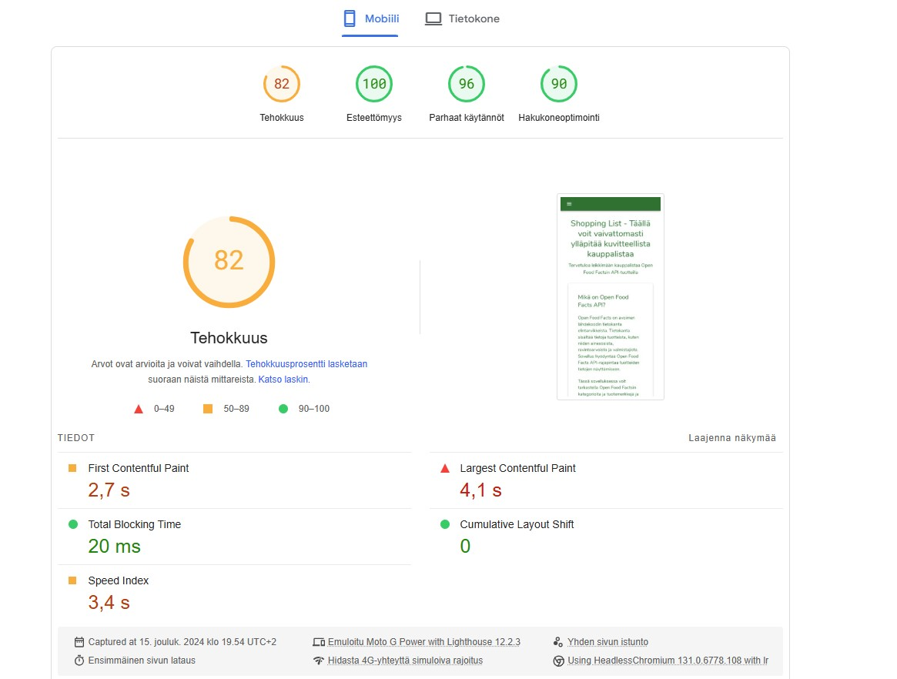
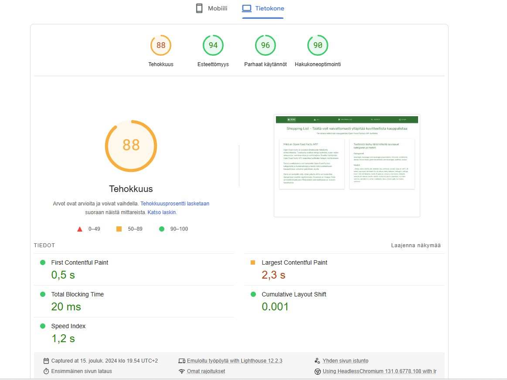

# Harjoitustyö

## Shopping List -sovellus
Sovellus on suunniteltu auttamaan käyttäjiä löytämään ja tallentamaan tietoja elintarviketuotteista, joita haetaan Open Food Facts -sovelluksen rajapinnan (API) kautta. Sovelluksen avulla käyttäjä voi etsiä elintarvikkeita ja lisätä ne kuvitteelliselle ostoslistalleen. Sovellus hyödyntää Firebasea käyttäjien autentikointiin ja Firestorea tietojen tallentamiseen ja säilyttämiseen.

Responsiivisuuteen on erityisesti panostettu, joten sovellus mukautuu eri kokoisille päätelaitteille, ja se tukee uusimpia selaimia. Nielsenin heuristiikat on huomioitu, ja sovelluksen ulkoasu ja navigointi ovat johdonmukaisia koko sovelluksessa.

### Responsiivisuus

#### Desktop
Elementit asettuvat toivotusti ja sovellus toimii ilman ongelmia.

#### Tabletti
Elementit asettuvat toivotusti ja sovellus toimii ilman ongelmia.

#### Mobiili
Elementit asettuvat toivotusti ja sovellus toimii ilman ongelmia. Navigaation responsiivisuus on varmistettu Drawer-komponentilla pienille näyttöko'oille. Käytössä on Reactin useMediaQuery-hook, jolla optimoidaan sisältöä mobiililaitteilla. Esimerkiksi ylimääräiset sarakkeet on kustomoidusti piilotettu Datagrid-komponentista mobiilikäyttäjille, jotta sisältö pysyy selkeänä ja luettavana. 

### Toimivuus uusimmilla selaimilla

**Google Chrome (v131)**: Kaikki toimii moitteettomasti

**Firefox (v133)**: Kaikki toimii moitteettomasti

**Microsoft Edge (v131)**: Kaikki toimii moitteettomasti

### Sivujen latautumisaika
Testaillessani havaitsin, että Open Food Factsin API-data oikuttelee ja latautuu välillä hitaasti millä tahansa välineellä (luultavasti suuren datamäärän ja kompleksisen rakenteen vuoksi). Tulokset eivät ole aivan huippuluokkaa, mutta kohtuullisia kuitenkin. Syytä sille, miksi lataus ei ole kovin nopeaa on vaikea yksilöidä, mutta sekin vaikuttanee, että kokeilunhaluissani tein ratkaisun hakea sovelluksen etusivullekin dynaamisesti dataa suoraan API:n kautta. Ensin meinasin tehdä datasta kaavioita, mutta niiden latautuminen vei vielä pidempään, joten nyt etusivulle on haettu vain listoja.

### Sovelluksen osoite
Sovellus on deployattu Verceliin: 
[Sovellus löytyy täältä](https://pilvipalvelut-htyo.vercel.app/)

